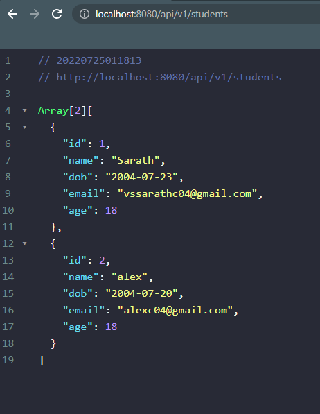

# Simple REST Server using SpringBoot

A simple rest server using spring boot coded form following the youtube video of [AmigosCode](https://www.youtube.com/c/amigoscode). The video can be found here: [Spring Boot Tutorial | Full Course [2022] [NEW]](https://www.youtube.com/watch?v=9SGDpanrc8U). With a changes and imporvements form myself I created this REST server which performs CRUD (Create, Read, Update, Delete) operations on a Data Base & returns the information using an api.

## Technologies used:

- Java
- Maven
- Spring
- SpringBoot
- Lombok
- jpa
- Postgres
- Docker
- Git & Github
- cmd script

## Screenshot

Json output of the api


## References

- [Tutorial](https://www.youtube.com/watch?v=9SGDpanrc8U)

## Installation

- Make sure to install

  - Java
  - Maven
  - Docker

- To run the postgres server using docker

```bash
docker compose up -d
```

The configuration is given in ./src/main/resources/application.properties
configure the database accordingly (or) change the required credentials

- To install dependencies

```bash
./mvnw install -f ./pom.xml
```

- To run the server

```bash
mvn spring-boot:run
```
